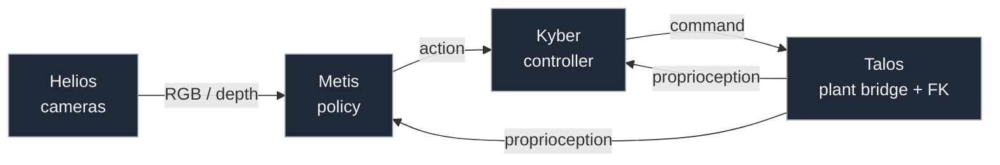
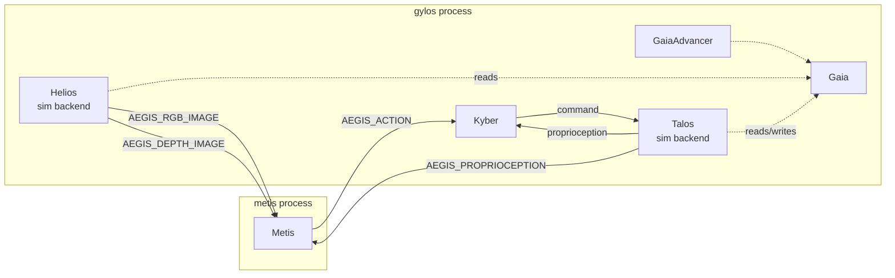
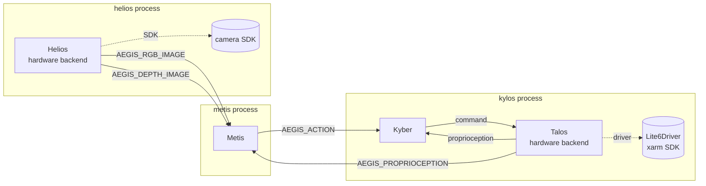

# aegis

The aegis stack is the manor manipulation runtime. It executes the full
observation → policy → controller → actuation → state-readback loop as
a small set of independent OS processes that talk over LCM. The same
diagram shape runs in sim and on hardware; only the per-block backends
and the process layout differ.

## Contents

1. [Overview](#overview)
2. [Why this design](#why-this-design)
3. [Process layout](#process-layout)
4. [Blocks](#blocks)
5. [Plugin protocols](#plugin-protocols)
6. [LCM bus](#lcm-bus)
7. [Configuration](#configuration)
8. [Quick start](#quick-start)
9. [CLI reference](#cli-reference)
10. [REPL](#repl)
11. [Standalone runners](#standalone-runners)
12. [Observing LCM traffic](#observing-lcm-traffic)
13. [Tests](#tests)
14. [Caveats / known limits](#caveats--known-limits)

## Overview

The pipeline is a textbook robot control loop, sliced into reusable
blocks:



Every arrow above is a typed Drake-port edge. Some are wired
in-process (tight feedback, no serialization); others are bridged onto
LCM channels at process boundaries. The split is decided by the block's
backend dependencies, not by the diagram shape — see
[Process layout](#process-layout).

Each block is a Drake `LeafSystem` with explicit input/output ports
declared via a `<Block>Ports` `StrEnum`, and a fixed periodic publish
rate. Blocks own no I/O state machines themselves — that's the
backend's job.

## Why this design

**Why processes, not threads.** Drake/numpy/CUDA each have fork-safety
and GIL constraints that make threading inside one Python process
fragile. `subprocess.Popen` gives crash isolation, real parallelism,
and the same launch shape for sim and hardware (the supervisor doesn't
care what's inside the subprocess).

**Why LCM, not gRPC/ROS.** LCM is the lowest-friction middleware that
preserves Drake's port-typing story: every aegis message has a
generated LCM type and an `attrs` definition, with adapters
(`AegisLCMPublisherAdapter` / `AegisLCMSubscriberAdapter`) bridging the
two transparently. No service definitions, no schema servers, no
external broker.

**Why the asymmetric process layout.** Helios's sim backend closes over
a Python handle to `Gaia`; that closure can't cross a process
boundary. So in sim the helios role lives inside the same process as
gaia. On hardware helios needs its own process because its backend
talks to a real camera SDK. Same logic for Kyber/Talos: in sim they
co-reside with gaia (talos needs the in-process gaia handle); on
hardware they live together against the real arm driver.

**Why direct wiring between Kyber and Talos.** The 500 Hz servo loop
between them is the tightest feedback path in the system. Bouncing it
through LCM would add latency for no benefit. Whenever two blocks live
in the same process and the loop matters, they're wired directly;
LCM is reserved for cross-process boundaries.

**Why every config field is required.** `AegisConfig` is the explicit
source of truth. Every sub-block must appear in the YAML — no implicit
factory defaults at the top level — so adding a new field surfaces in
every config file rather than silently inheriting a default that
diverges between dev and prod.

## Process layout

Sim mode runs **2 processes** — `metis` + `gylos`:



Hardware mode runs **3 processes** — `metis` + `kylos` + `helios`:



Solid arrows are LCM hops between processes. Dotted arrows are
in-process direct wires (no serialization).

The supervisor (`aegis run <block>`) launches the relevant subprocesses
for the configured mode and tracks their PIDs in `/tmp/aegis_<block>.pid`
so subsequent shells can see them.

## Blocks

### Metis — policy

Metis is the high-level brain: observation → action.

- **Inputs:** `INPUT_PROPRIOCEPTION`, `INPUT_RGB_IMAGE`, `INPUT_DEPTH_IMAGE`
  (all received from LCM in the metis process).
- **Output:** `OUTPUT_ACTION` — what the robot should do at the policy
  level (currently a joint-position or joint-velocity intent; designed
  to extend to EEF-space actions).
- **Internals:** every `1 / publish_frequency_hz` it bundles the
  current proprioception + RGB into an `Observation`, calls
  `policy.step(observation)`, and zero-order-holds the resulting
  `Action` on its output port. The output adapter publishes that
  action on `AEGIS_ACTION`.
- **Default rate:** 10 Hz. Policies that need richer input (depth,
  history, vision features) extend `Observation`; the diagram wiring
  doesn't change.

The policy itself is pluggable — see
[Plugin protocols](#plugin-protocols).

### Kyber — controller

Kyber is the low-level servo loop: action → command.

- **Inputs:** `INPUT_ACTION` (from Metis over LCM),
  `INPUT_PROPRIOCEPTION` (from Talos, direct in-process).
- **Output:** `OUTPUT_COMMAND` — motor-level setpoint. Wired directly
  to Talos in the same process; never serialized over LCM.
- **Internals:** every `1 / publish_frequency_hz` it calls
  `controller.step(action, proprioception)` and zero-order-holds the
  result on its output port.
- **Default rate:** 500 Hz — fast enough to track the configured arm.

The controller is pluggable; see [Plugin protocols](#plugin-protocols).
The controller manager takes the `manipulator_model` alongside its
config so plant-building controllers (diff-IK, joint-space PID with FK
lookups, etc.) can build their own Drake `MultibodyPlant` inside their
constructor. Kyber itself owns no plant.

### Talos — plant bridge + FK

Talos is the hardware/sim shim: command → actuation, joint state →
proprioception.

- **Input:** `INPUT_COMMAND` (from Kyber, direct).
- **Output:** `OUTPUT_PROPRIOCEPTION` — wired both directly back to
  Kyber (tight feedback) and to an LCM publisher (so Metis sees it
  from the metis process).
- **Internals:** owns its own FK-only `MultibodyPlant` (no scene
  graph) built from `manipulator_model`. Every tick it forwards the
  command to its backend, reads joint+EEF state back, computes EEF
  pose/twist via FK, and assembles a `Proprioception` message.
- **Backend:** the `ManipulatorBackend` Protocol (`send_command`,
  `read_joint_state`, `read_eef_state`, `start`, `stop`). In sim the
  backend closes over `Gaia`; on hardware it wraps an
  `IManipulatorDriver` (currently `Lite6Driver` over the xarm SDK).
- **Default rate:** 200 Hz.

### Helios — cameras

Helios publishes RGB and depth streams.

- **Inputs:** none.
- **Outputs:** `OUTPUT_RGB_IMAGE`, `OUTPUT_DEPTH_IMAGE` (each only
  declared if its frequency is > 0).
- **Internals:** independent periodic events per stream so RGB and
  depth can run at different cadences (or one can be disabled
  entirely, including at the port level).
- **Backend:** the `SensorBackend` Protocol (`read_rgb`, `read_depth`,
  `start`, `stop`). In sim it closes over `Gaia`; on hardware it
  wraps a real camera SDK (currently a stub).
- **Default rate:** 30 Hz for both streams.

### Gaia — simulated world

Gaia is the simulated world. Used in sim mode only.

- **Owns:** a `MultibodyPlant`, `SceneGraph`, optional `Meshcat`,
  optional RGB-D sensors, an internal `Simulator`, and the manipulator
  + extra static models welded into the plant.
- **Lifecycle:** constructed cheap (just config), then `finalize()`
  builds the plant, parses URDFs from `environment_config`, registers
  cameras, and stamps out the internal Simulator. Read/advance methods
  raise `GaiaError` if called pre-finalize.
- **Methods used by backends:** `advance_to(t)`,
  `apply_joint_position_command` / `apply_joint_velocity_command`,
  `read_joint_state`, `set_joint_positions`, `render_rgb`,
  `render_depth`.
- **Plant time step:** `0.0` by default (continuous-time integration);
  set `gaia_config.time_step` to a small positive value for discrete
  integration (faster, slightly less accurate).
- **Meshcat:** when `gaia_config.enable_meshcat: true`, Gaia spawns a
  Meshcat HTTP server on finalize and prints the URL. Open it in any
  browser to watch the plant.

### Gaia advancer — sim clock pump

The gaia advancer is a small `LeafSystem` that periodically calls
`gaia.advance_to(context.get_time())`. It exists only in sim mode and
keeps the inner Drake simulator (Gaia's) ticking against the outer
diagram's clock. No input/output ports — pure side effect. Default
rate 500 Hz so sensor reads always land on freshly stepped state.

## Plugin protocols

Both Metis and Kyber are policy/controller-shaped: the diagram is
fixed; the brain inside is hot-swappable.

### MetisPolicy

```python
class MetisPolicy(Protocol):
    def step(self, observation: Observation) -> Action: ...
```

Concrete policies live under `metis/policies/`. Each provides a
`<Name>Policy` class plus a `<Name>PolicyConfig` (a frozen attrs class
with `POLICY_TYPE: ClassVar[MetisPolicyType]` pinning it to the enum
tag used in YAML).

Currently shipped:

| `MetisPolicyType` | what it does                                                |
| ----------------- | ----------------------------------------------------------- |
| `zero_velocity`   | emits a zero joint-velocity action regardless of input.     |
| `identity`        | mirrors the measured joint positions back as a joint-position action. |

### KyberController

```python
class KyberController(Protocol):
    def step(self, action: Action, proprioception: Proprioception) -> Command: ...
```

Same factory shape under `kyber/controllers/`. Each provides a
`<Name>Controller` plus `<Name>ControllerConfig` with
`CONTROLLER_TYPE: ClassVar[KyberControllerType]`.

Currently shipped:

| `KyberControllerType` | what it does                                            |
| --------------------- | ------------------------------------------------------- |
| `zero_velocity`       | emits a zero joint-velocity command (safe default).     |
| `passthrough`         | passes the action's joint positions through verbatim.   |

### Adding a new policy or controller

1. Add a module under `metis/policies/` or `kyber/controllers/`.
2. Add an enum value to `MetisPolicyType` / `KyberControllerType`.
3. Add the dispatch branch to the manager's `from_config` and
   `config_from_yaml_dict` classmethods.
4. Reference it from YAML by setting `policy_config.type` /
   `controller_config.type` to the new tag.

The `from_yaml_dict` round-trips through the manager: it reads the
`type:` discriminator, strips it, and dispatches the rest of the body
to the matching subclass's `from_yaml_dict`.

## LCM bus

Every cross-process edge is an LCM channel. Channel names are an
enum, not raw strings:

| `AegisChannel` member | wire name              | publisher          | subscriber |
| --------------------- | ---------------------- | ------------------ | ---------- |
| `ACTION`              | `AEGIS_ACTION`         | metis              | kylos / gylos (kyber) |
| `PROPRIOCEPTION`      | `AEGIS_PROPRIOCEPTION` | kylos / gylos (talos) | metis  |
| `RGB_IMAGE`           | `AEGIS_RGB_IMAGE`      | helios / gylos (helios) | metis |
| `DEPTH_IMAGE`         | `AEGIS_DEPTH_IMAGE`    | helios / gylos (helios) | metis |
| `COMMAND`             | `AEGIS_COMMAND`        | (reserved; unused — Kyber→Talos is direct) | — |
| `OBSERVATION`         | `AEGIS_OBSERVATION`    | (reserved for future use) | — |

### Adapters: attrs ↔ LCM

LCM speaks raw bytes; the rest of the diagram speaks `attrs`-typed
definitions (`Action`, `Proprioception`, `RGBImageData`, ...). Two
adapter `Diagram`s bridge them:

- **`AegisLCMSubscriberAdapter`**: wraps `LcmSubscriberSystem` + a
  translator leaf that calls `definition_cls.from_lcm_message(...)`.
  Exports a single `DEFINITION_OUTPUT` port carrying the
  `attrs`-typed value.
- **`AegisLCMPublisherAdapter`**: wraps a translator that calls
  `.to_lcm_message()` + `LcmPublisherSystem`. Imports a single
  `DEFINITION_INPUT` port and publishes at a configured rate.

Every aegis definition (`Proprioception`, `Action`, `Command`,
`RGBImageData`, `DepthImageData`) implements `to_lcm_message()` /
`from_lcm_message()` over a generated LCM type, so the adapters work
generically — no per-message wiring code.

## Configuration

The default config lives at `configs/aegis/lite6_default.yaml`:

```yaml
mode: sim
manipulator_model: { type: lite6, variant: parallel_gripper_normal }
environment_config:
  manipulator_base_xyz: [0.0, 0.0, 0.7366]
  manipulator_base_rpy: [0.0, 0.0, 0.0]
  extra_models:
    - { name: lite6_table, description_filepath: environment/lite6_table.urdf, ... }
helios_config:
  publish_rgb_frequency_hz: 30.0
  publish_depth_frequency_hz: 30.0
  sim_backend_config:      { camera_id: default }
  hardware_backend_config: { serial_number: "", rgb_height: 480, ... }
talos_config:
  publish_frequency_hz: 200.0
  sim_backend_config: {}
  hardware_backend_config: {}
metis_config:
  publish_frequency_hz: 10.0
  policy_config: { type: zero_velocity, num_joints: 6 }
kyber_config:
  publish_frequency_hz: 500.0
  controller_config: { type: zero_velocity, num_dof: 6 }
gaia_config:
  time_step: 0.0
  enable_meshcat: true
  target_realtime_rate: 1.0
  rgb_height: 480
  rgb_width: 640
  depth_height: 480
  depth_width: 640
gaia_advancer_config:
  advance_frequency_hz: 500.0
```

Top-level keys map 1:1 to attrs fields on `AegisConfig`; sub-blocks
recurse the same way. Every block is **required** in the YAML —
inner fields within a block can omit defaults (e.g.
`talos_config.sim_backend_config: {}` is valid), but the block itself
must be present.

To switch policies / controllers, edit
`metis_config.policy_config.type` (one of `MetisPolicyType`) or
`kyber_config.controller_config.type` (one of `KyberControllerType`).
Toggle the visualiser via `gaia_config.enable_meshcat`. Change sim
playback speed via `gaia_config.target_realtime_rate` (`0.0` = as fast
as possible, `1.0` = real time).

The CLI accepts `--config` to load a different YAML; per-field
overrides on the command line are deferred until there's a real need.

## Quick start

```bash
# In the manor conda env
aegis run gylos       # spawn the sim world (Meshcat URL prints to stdout)
aegis run metis       # spawn the policy
aegis status          # confirm both alive
aegis kill metis
aegis kill gylos
```

That's it for the typical sim session. Open the printed Meshcat URL in a
browser to watch the plant.

## CLI reference

```text
aegis [-c CONFIG] <command>
```

Flags:

- `-c PATH`, `--config PATH` — aegis YAML to load. Defaults to
  `configs/aegis/lite6_default.yaml` (resolved from the manor repo
  root). The YAML is parsed and validated once; bad configs fail fast.
- `-h`, `--help` — works at the top level and on every subcommand.

Commands:

| command                | what it does                                                          |
| ---------------------- | --------------------------------------------------------------------- |
| `run <block>`          | spawn `<block>` as a subprocess; refuses if it's already running or doesn't apply to the configured mode. |
| `kill <block>`         | SIGTERM `<block>`'s subprocess.                                       |
| `status [<block>]`     | report `<block>`'s state (alive + PID, or stopped). With no arg, equivalent to `list`. |
| `list`                 | list every block applicable to the current mode + state.              |
| `repl`                 | drop into an interactive prompt_toolkit shell.                        |

State persists across shells via `/tmp/aegis_<block>.pid`. Stale PID
files (process gone, file remained) are auto-cleaned on the next
`status`/`run`.

## REPL

```bash
aegis repl
```

Drops you into:

```text
aegis repl -- mode=sim, config=/.../lite6_default.yaml
type 'help' for commands, 'exit' or Ctrl-D to leave (children keep running).
aegis>
```

Inside, the same commands minus the `aegis` prefix:

```text
aegis> list
aegis> run gylos
aegis> run metis
aegis> status
aegis> kill metis
aegis> kill gylos
aegis> exit
```

- Tab-complete: `run g<TAB>` → `run gylos`.
- Arrow-up recalls past lines (history persists at `~/.aegis_history`).
- Ctrl-C clears the current line; Ctrl-D / `exit` / `quit` leaves the
  REPL. Spawned children keep running.

## Standalone runners

Each per-block runner is also runnable directly as `python -m`. Useful
for dev iteration when you don't want to go through the supervisor.

```bash
# Convert the YAML to JSON once
python -c "import json, yaml; print(json.dumps(yaml.safe_load(open('configs/aegis/lite6_default.yaml'))))" > /tmp/aegis.json

# In one terminal
python -m manor.common.aegis.run.run_gylos < /tmp/aegis.json

# In another terminal
python -m manor.common.aegis.run.run_metis < /tmp/aegis.json
```

The runner reads the full parsed-AegisConfig dict from stdin and slices
out only the keys it needs. Ctrl-C in either terminal stops that block;
no PID files are written.

## Observing LCM traffic

The `manor_lcm_spy` console script launches `lcm-spy` with the manor
LCM type bindings on the Java classpath, so messages on `AEGIS_*`
channels show up decoded:

```bash
manor_lcm_spy
```

For a quick sanity check from the command line:

```bash
timeout 5 lcm-logger /tmp/aegis_capture.log
python -c "
import lcm
log = lcm.EventLog('/tmp/aegis_capture.log')
counts = {}
for ev in log:
    counts[ev.channel] = counts.get(ev.channel, 0) + 1
for ch, n in sorted(counts.items()):
    print(f'{ch}: {n}')
"
```

You should see:

- `AEGIS_ACTION` — metis publishing.
- `AEGIS_PROPRIOCEPTION` — talos publishing (via gylos in sim, kylos on hw).
- `AEGIS_RGB_IMAGE` / `AEGIS_DEPTH_IMAGE` — helios publishing (via gylos in sim, helios process on hw).

Counts are typically below the configured frequencies because gylos
runs slightly below realtime (lots of periodic events plus continuous
integration); the wiring is correct as long as every channel fires at
least once.

## Tests

```bash
python -m pytest src/manor/common/aegis -q
```

Runs all aegis unit + smoke tests (diagram-build, YAML round-trip,
runner imports, CLI commands). The CLI tests sandbox PID files into a
`tmp_path` so they don't collide with a running aegis stack.

## Caveats / known limits

- **The arm doesn't move on command yet.** `Gaia.apply_joint_*_command`
  stashes the latest command but the plant's actuation port is force-
  fixed to zero. The pipeline ticks correctly end-to-end; the visible
  behaviour is the arm sitting (or drooping under gravity, depending on
  the URDF). Wiring a tracking controller into Gaia is the obvious next
  milestone.
- **Talos's EEF FK is stubbed.** `_compute_eef_pose` /
  `_compute_eef_twist` return identity / zeros. Doesn't affect the
  pipeline; just means downstream consumers of EEF state get
  placeholders.
- **Helios sim/hardware backends return empty frames.** RGB-D rendering
  via Drake's `RgbdSensor` and the real-camera SDK paths are both
  stubbed; the channels publish at the configured rates but the
  payloads are placeholder images.
- **gylos runs below realtime.** kyber at 500 Hz + helios at 30 Hz +
  gaia advancer at 500 Hz + continuous-time integration adds up.
  Switching `gaia_config.time_step` to a small discrete value (e.g.
  `0.001`) speeds it up at the cost of integration accuracy.
